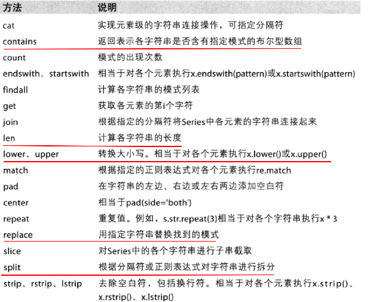
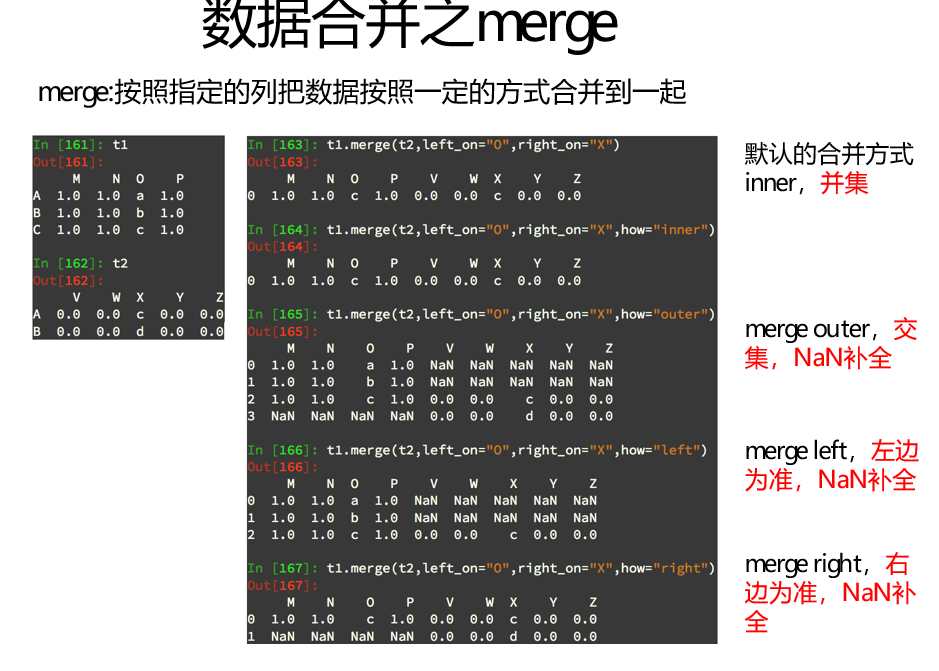
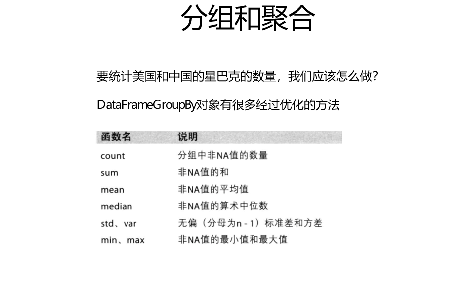
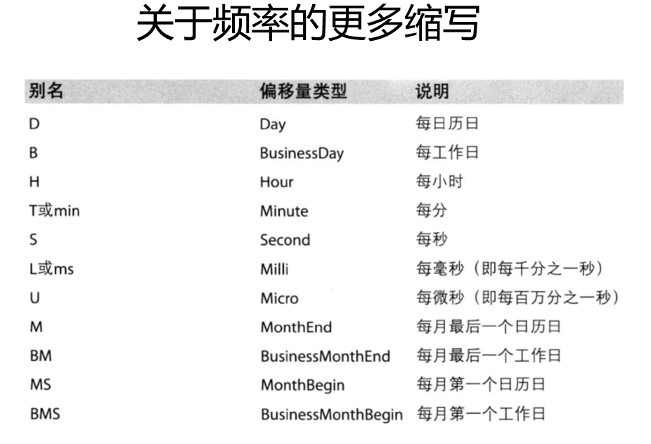

# pandas简单应用

## 一、pandas的常用数据类型

1. `Series` 一维，带标签数组
2. `DataFrame` 二维,`Series`容器

## 二、pandas之Series创建

1. `pd.Series(一维数组,index = list(字符串))`
    * `index`参数可以修改`Series`的标签（索引），要注意有多少个数据，标签也要有多少个
    * 也可以通过字典来创建一个`Series`

2. `Series`也有`dtype`
    * 使用方法:`x.dtype`
    * `'o'` 是字符串的意思
    * 其他和numpy差不多

3. 修改`Series`的数据类型
    * 使用方法：`x.astype(类型)`
    * 例如：`t1.astype(int64)`

## 三、pandas中Series切片和索引

1. 可以通过索引来取（字符串），也可以通过位置来取（数字）

2. 取前n行：
    * 方法：`x[:n]`
3. 取不连续的第几行：
    * 方法:`x[[a,b]]`
    * 取出第a+1行和第b+1行
    * 也可以将字符放入列表中当做参数传入进去，这样也可以获取指定的行
    * 如果你放入的字符不存在该索引时，对这个字符会赋值为nan
4. 布尔索引：
    * 方法：`x[x>10]`
    * 选出x中大于10的所有数据

## 四、pandas中Series的索引和值

1. `Series`的`index`属性
    * 方法：`x.index`
    * 返回一个类似字符串列表的东西，是`index`类型
    * 可以用`len()`测量`index`的长度
    * 可以用`list(x.index)`将`index`转化成列表，还能对这个列表进行切片
2. `Series`的`value`属性
    * 方法：`x.value`
    * 返回`Series`中的数据
3. `ndarray`中的很多方法也适用于`series`类型
    * `argmax、clip`
4. `series`具有`where`方法，但结果和`ndarray`不同

## 五、pandas读取外部数据

1. 就`pd.readxxx()`写了pd.read后就会弹出智能提示，我们选择我们需要的方式即可

2. 数据库（mysql或者mongodb）中的数据读取
    * 使用`pd.read_sql(sql_sentence,conction)`

## 六、pandas的DataFrame

1. 创建`dataFrame`
    * `pd.DataFrame(np.arange(12).reshape((3,4)))`
2. `DataFrame`既有行索引又有列索引
    * 行索引，表明不同的行，横向索引，叫index，0轴，axis = 0
    * 列索引，表明不同的列，纵向索引，叫columns,1轴，axis = 1
3. `DataFrame`也可以由字典来创建

    ```python
    # 创建字典
    d1 = {"name":["xiaoming","xiaohong"],"age":[20,32],"tel":[10086,10010]}
    # 将字典导入DataFrame进行创建
    pd.DataFrame(d1)
    ```

    ```html
    结果为：
                name     age    tel
            0  xiaoming   20  10086
            1  xiaohong   32  10010
    ```

4. 用多个字典创建`DataFrame`

    ```python
    # 创建多个字典，并将字典放入一个列表中
    d2 = [{"name":"xiaogong","age":33,"tel":1000},{"name":"xiaohong","tel":10000},{"name":"xiaoli","age":22}]

    # 将装有字典的列表导入DataFrame进行创建
    pd.DataFrame(d2)
    ```

    ```html
    结果为：
                age      name      tel
            0  33.0  xiaogong   1000.0
            1   NaN  xiaohong  10000.0
            2  22.0    xiaoli      NaN
    ```

    * 缺失的位置会用NaN表示

5. `DataFrame`的基本属性
    * `df.shape`  行数和列数
    * `df.dtypes` 数据类型
    * `df.ndim`  数据维度
    * `df.index` 行索引
    * `df.columns` 列索引
    * `df.values` 对象值，二维ndarray数组

6. `DataFrame`整体情况查询
    * `df.head(3)` 显示头部几行，默认5行
    * `df.tail(3)` 显示末尾几行，默认5行
    * `df.info()`  相关信息概览：行数、列数、列索引、列非空值个数、列类型、列类型、内存占用
    * `df.describe()` 快速综合统计结果：计算，均值，标准差，最大值，四分位数，最小值

7. `dataFrame`的排序方法：
    * `df.sort_values(by="列索引",ascending(True/False))`
    * `by`需要按照哪个列索引进行排序
    * `ascending`升序还是降序，布尔值。默认True（升序）

8. `dataFrame`方法：
    * `df.sum()`axis,等于0时对列求和，表示1时对行求和

## 七、pandas取行取列

1. 取行：`df[:n]`取前n行
2. 取列：`df["列索引"]`
3. 注意点：
    * 方括号中写数组,表示取行，对行进行操作
    * 方括号中写字符串，表示取列索引，对列进行操作
4. 同时选择行和列：`df[:100]["列索引"]`

## 八、pandas的loc

1. `df.loc`通过标签索引行数据
    * `x.loc["a","b"]`取第a行第b列
    * `x.loc["a",:]`取第a行
    * `x.loc[:, "a"]`取第a列
    * `x.loc[["a","b"],["c","d"]]`取出位置[a,c][a,d][b,c][b,d]位置的数据并排列
2. `df.iloc`通过位置获取行数据,
    * `x.iloc[1,:]`取出第二行的数据
    * `x.iloc[:,2]`取出第三列的数据
    * `x.iloc[:,[2,1]]`取出第二列和第一列的数据
    * `x.iloc[[0,2],[2,1]]`取出位置[0,2][0,1][2,2][2,1]的位置
3. 赋值，和numpy一样也是直接在选出来后直接赋值

## 九、pandas布尔索引

1. 索引方式`df[50<df["列索引"]]`
   * 当使用连写时可以这样
   * `df[(25<df["Count_AnimalName"])&(df["Count_AnimalName"]<70)]`
   * &表示且 | 表示或者
   * 不同条件之间需要用括号括起来

## 十、pandas的字符串方法



1. 切割字符串及把切割出来的东西包装成数组
    * `df["列索引"].str.split("/").tolist()`

## 十一、pandas缺失数据处理

1. 两种缺失情况：
    * 一种是空（NaN）,None
    * 另一种是0
2. 使用方法`pd.isnull(dataframe)`判断dataframe中的数据哪些为nan
3. 使用方法`pd.notnull(dataframe)`判断dataframe中哪些数据不为nan
4. 删除nan对应行：（处理方式1）
    * `x.dropna(axis=0,how="any",inplace=False)`
    * `axis`表示要删除的是行还是列，默认0（行），1是列
    * `how`表示删除的方式,默认any表示有一个nan就删除，all表示全为nan才删除
    * `inplace`对原来的dataframe进行修改
5. 填充nan：（处理方式2）
    * `t.fillna(t.mean())、t.fillna(0)`
    * 第一种，用均值填充
        * 不全部都填充t["列索引"].fillna(t["列索引"].mean())
        * pandas计算均值时会主动排除nan与numpy不同
    * 第二种，用指定数字填充nan
6. 处理为0的缺失数据（当0缺失为缺失数据的时候才能使用）
    * `t[t==0]=np.nan`
    * 使用布尔索引找到所有为0的值，然后将其赋值为nan如上操作即可
    * 计算均值时nan不参加计算，但是0会参加计算

## 十二、pandas统计方法

1. `x[ ].unique()`，将选中行或列中的数据形成一个列表，重复的数据只会出现一次

2. 处理列表嵌套列表的方法：
    * 两个循环解决

    ```python
    # data是两个列表嵌套的数据
    # 循环取出
    temp = [i for j in data for i in j]
    ```

## 十三、pandas数据合并

1. `dataframe1.join(dataframe2)`方法：
    * 将`dataframe2`水平拼接到`dataframe1`中以，`dataframe1`为准，多的去掉，少的nan表示
    * 按行索引进行合并

2. `dataframe1.merge(dataframe2,on="列索引")`方法：
    * 不是单纯的接上去，按照列索引接上去，就是说如果列索引对应才接上去，否则不接，增加的是列，不是行
    

3. 添加一行可用append方法，（A.append（B）但是B的columns必须与A的columns一致

## 十四、pandas分组聚合

1. `group = DataFrame.groupby（by = "列索引"）`会将数据按照指定的列索引进行分组，并成成一个对象
2. 这个对象可以被迭代遍历，有两个值，一个是列索引的名称，一个是用来处理符合当前索引名称的dataframe
3. `group.count()`在`group`对象中的每一个索引的每一个特征进行统计


## 十五、索引和复合索引

1. `df.index`获取索引
2. `df.index = ["x","y"]`给索引赋值
3. `df.reindex(list("abcd"))`取abcd行，然后再赋值给df，如果不存在该行就为nan
4. `df.set_index("列索引")`以某一列作为索引，然后行索引就变成这一列了
    * 默认情况下，指定的列作为索引后就在原数据中的这一列就消失了如果要保留，需要给参数赋值`drop = False`
    * "列索引"的位置可以放一个字符列表或者数字列表，就会形成复合索引
5. 索引是可以重复的可以使用`df.set_index("列索引").index_unique()`返回唯一的索引
6. series类型的复合索引如何取指定数字：
    * `Se["第一个索引名"]["第二个索引名"]`就能取到指定的数字
    * 也可以使用`Se.["第一个索引名","第二个索引名"]`
    * 如果只输入前面那个就会返回，第一个索引中的全部数字
7. `d.swaplevel()`交换里层和外层的索引

## 十六、时间序列

1. 生成一段时间范围：
    * `pd.date_range(start=None,end=None,periods=None,freq="D")`
    * 生成在start到end时间范围内以频率freq的一组时间索引
    * periods为生成的个数
    * 频率的缩写
    
2. 把时间字符转化成时间序列：
    * `df["时间的索引名"] = pd.to_datatime(df["时间索引名"]))`
3. 重采样：指的是将时间序列从一个频率转化成另一个频率进行处理的过程，将高频率数据转化为低频率数据为降采样，低到高为升采样
    * 用resample方法实现这个频率变化
    * `t.resamle("M")`转化成按月统计，可以在后面加sum。mean之类的方法实现按月计算功能
    * t是代表一个用时间序列做索引的DataFrame，在resamle之后会生成一个可迭代对象，每次迭代返回一个可迭代对象，每次迭代有两个返回值，一个是时间，一个时这个时间段的数据
    * `strtime(%Y%m%d)`方法规定输出格式，这个就是规定格式为年月日
4. 用时间作为索引，
    * 先将时间字符串转化成时间序列，然后用df.set_index("时间列索引",inplace=True)将时间序列作为索引，然后就可以通过时间找到对应的列进行分组运算
5. `PeriodsIndex`：
    * dataindex可以理解为时间戳(连续数字字符串)，periodsindex可以理解为时间段（年月日都是数据的一个特征）
6. 把分开的时间字符串转换成pandas的时间类型：

```python
#把分开的时间字符串通过periodIndex的方法转化为pandas的时间类型
period = pd.PeriodIndex(year=df["year"],month=df["month"],day=df["day"],hour=df["hour"],freq="H")
df["datetime"] = period
```

```html
转化前：
             year  month  day  hour
        0    2010      1    1     0
        1    2010      1    1     1
        2    2010      1    1     2

转化后：
             datetime
        0   2010-01-01 00:00
        1   2010-01-01 01:00
        2   2010-01-01 02:00
```
