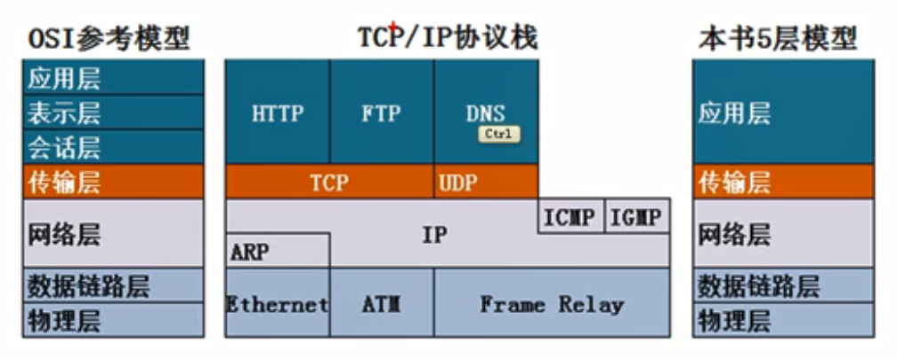
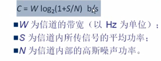

# 计算机网络

## OSI参考模型

1. 应用层：所有能产生网络流量的程序
2. 表示层：在传输之前是否进行加密或者压缩处理  二进制  ASCII码
3. 会话层：查木马  nestat -n或者-nb
4. 传输层：可靠传输  流量控制   不可靠传输
5. 网络层：负责选择最佳路径 规划IP地址
6. 数据链层：帧的开始和结束  透明传输  差错校验
7. 物理层：借口标准  电器标准  如何在物理链路上传输更快的速度 

## OSI参考模型网络怕错指导

1. 物理层故障：查看链接状态，发送和接收的数据包
2. 数据链路层故障：MAC冲突，ADSL欠费，网速没办法写上一致，计算机链接到错误的VLAN
3. 网络层故障：配置错误的IP地址，子网掩码，配置错误的网关，路由器没有配置到目标网络的路由
4. 应用层故障：应用程序配置错误

## OSI参考模型和网络安全

1. 物理层安全
2. 数据链路层安全：ADSL  账号密码  VLAN  交换机端口绑定MAC地址
3. 网络层安全：在路由器上使用ACL控制数据包流量
4. 应用层安全：开发的应用程序没有漏洞

## TCP/IP协议栈和OSI参考模型
* 

## 物理层基本概念

1. 机械特性，电器特性，功能特性，过程特性

## 数据通信的基础知识

1. 信道：单工信道、半双工信道、全双工信道
2. 基带信号  贷通信号
3. 调制方法：调幅，调频，调相
4. 常用的编码：单极不归零码，双极不归零码，单极归零码，双极归零码
5. 曼切斯特编码。差分曼切斯特编码
6. 信道的容量
    * 奈氏准则：没有信号干扰，码元的传输速率有上限
    * 香农公式：有信号干扰，无差错传输速率
    * 